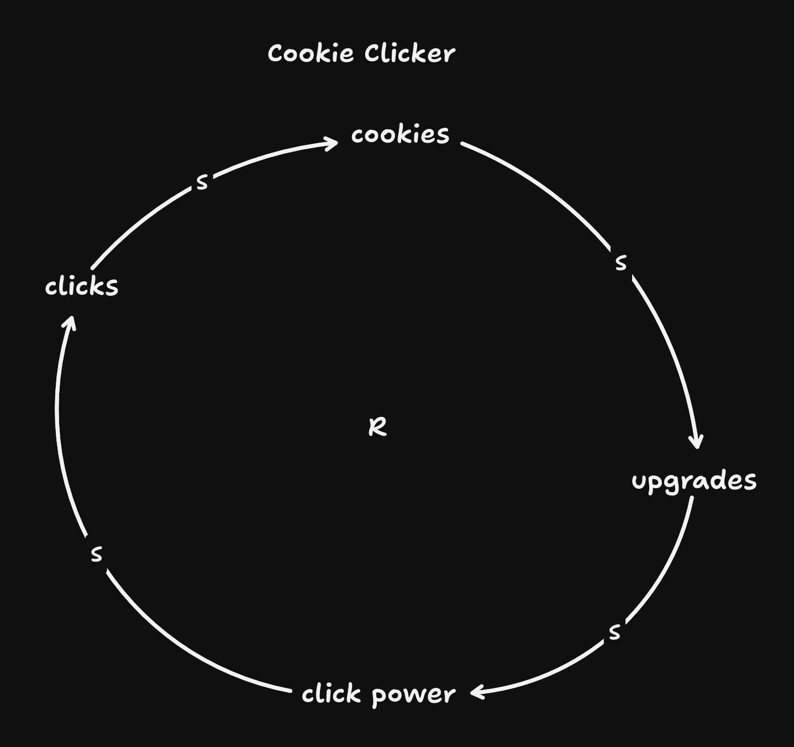
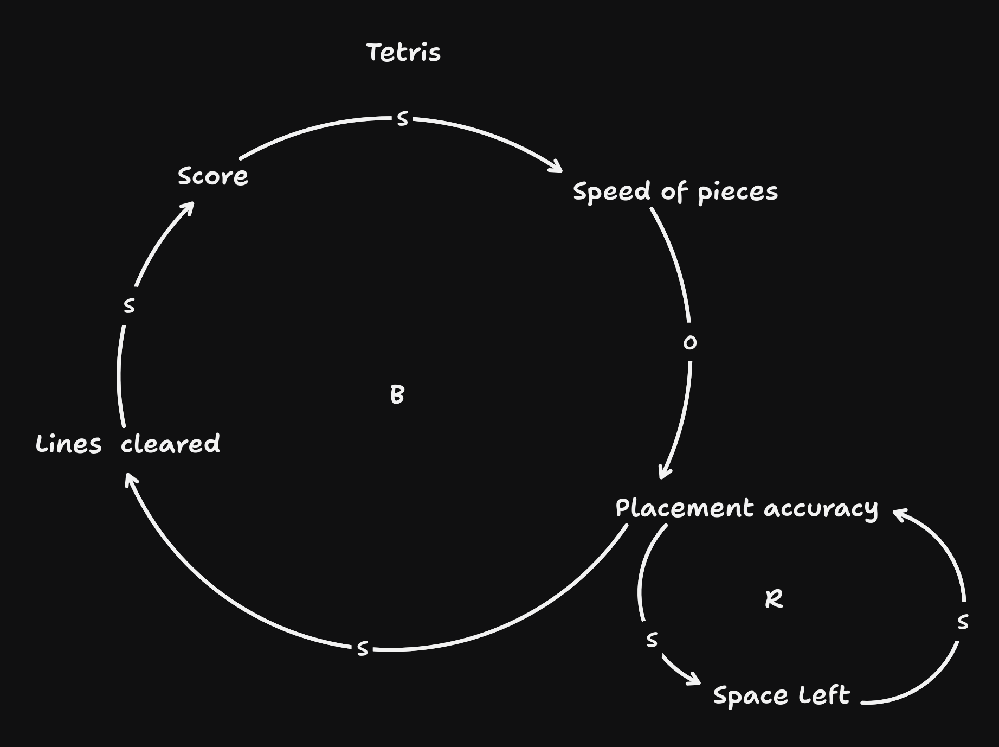
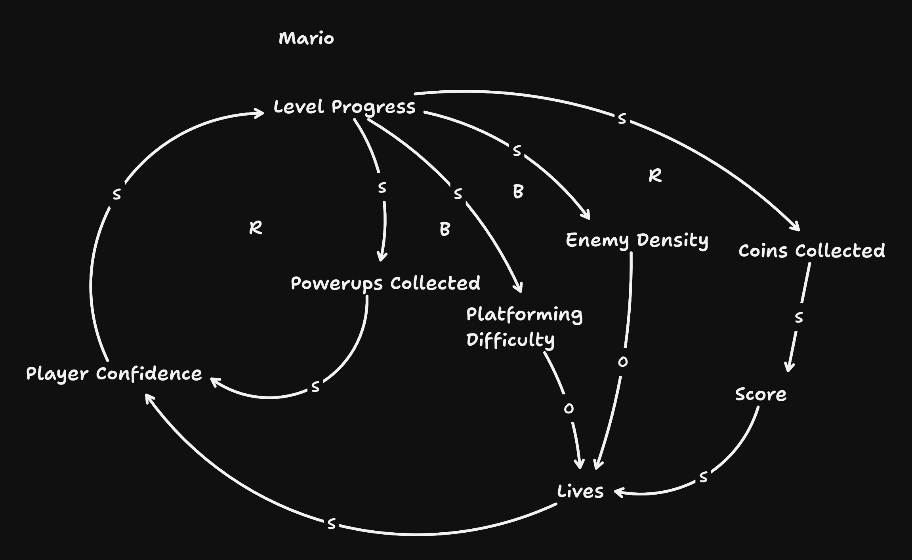

---

# Advanced Game Design
Chapter 2 - Defining Systems

---
> It is important to remember, however, that systems (and things, deep down) are dynamic, not  static: you cannot understand a system by freezing it in place; you must experience it operating  in its context to truly understand it... it is difficult to define them in a single bumper-sticker-like  sentence.
---
# Definition of a System
> A set of parts that together form loops of interaction between them to create a persistent “whole.” The  whole has its own properties and behaviors belonging to the group but not to any single part within it.
---
# Definition of a System
■ Systems are made out of parts. Parts have internal state and external boundaries. They  interact with other parts via behaviors. Behaviors send information or, more often, resources to other parts to affect the internal state of the other parts.

---
# Definition of a System
■ Systems are made out of parts. Parts have internal state and external boundaries. They  interact with other parts via behaviors. Behaviors send information or, more often, resources to other parts to affect the internal state of the other parts.

■ Parts interact with other parts via behaviors to create loops. Behaviors create local  interactions (A to B), while loops create transitive interactions (A to B to C to A).

---
# Definition of a System
■ Systems are made out of parts. Parts have internal state and external boundaries. They  interact with other parts via behaviors. Behaviors send information or, more often, resources to other parts to affect the internal state of the other parts.

■ Parts interact with other parts via behaviors to create loops. Behaviors create local  interactions (A to B), while loops create transitive interactions (A to B to C to A).

 ■ Systems are organized into hierarchical integrative levels that arise from emergent properties based on their looped structures. At each level, the system displays organized  state and behavior, synonymous with being a part in larger system at the next level up.

---
# Definition of a System
■ Systems are made out of parts. Parts have internal state and external boundaries. They  interact with other parts via behaviors. Behaviors send information or, more often, resources to other parts to affect the internal state of the other parts.

■ Parts interact with other parts via behaviors to create loops. Behaviors create local  interactions (A to B), while loops create transitive interactions (A to B to C to A).

 ■ Systems are organized into hierarchical integrative levels that arise from emergent properties based on their looped structures. At each level, the system displays organized  state and behavior, synonymous with being a part in larger system at the next level up.

 ■ At each level the system displays persistence and adaptability. It does not fall apart quickly,  being self-reinforcing, and is able to tolerate and adapt to different conditions that exist  outside its boundaries.

---
# Definition of a System
■ Systems are made out of parts. Parts have internal state and external boundaries. They  interact with other parts via behaviors. Behaviors send information or, more often, resources to other parts to affect the internal state of the other parts.

■ Parts interact with other parts via behaviors to create loops. Behaviors create local  interactions (A to B), while loops create transitive interactions (A to B to C to A).

 ■ Systems are organized into hierarchical integrative levels that arise from emergent properties based on their looped structures. At each level, the system displays organized  state and behavior, synonymous with being a part in larger system at the next level up.

 ■ At each level the system displays persistence and adaptability. It does not fall apart quickly,  being self-reinforcing, and is able to tolerate and adapt to different conditions that exist  outside its boundaries.

 ■ Systems exhibit organized, decentralized, but coordinated behaviors. A system creates a  unified whole—which is in turn just a part of a larger system.

---
# Parts

Each part is independent of others in  that each has its own identity and acts on its own. Specifically, each part is defined by its state, boundaries, and behaviors,

---
## State
> Each part has its own internal state. This is made up of a combination of attributes, each of  which has a specific value at any point in time. So each bird in a flock has its own speed,  direction, mass, health, and so on. The bird’s speed and mass are attributes, and each have a  value (for these, a number) that is the attribute’s current state. The part’s state overall is the  aggregation of all of its current attribute values.
---

> In games, a part’s state is often determined by the states of parts within it at a finer level of  detail: a forest might not have its own “health” attribute but instead may use the aggregate of  the state of every tree defined within it. However, at some point you have to “hit bottom” and  create simple parts with attribute/value pairs that are simple, nonsystemic types—integers,
---
## Boundaries
> A part’s boundary is an emergent property... defined by  the local neighborhood of interaction of subparts within it.

<!-- > Parts that are closely  networked together—those with more interactions with each other than with other parts—and  in particular those with interactions that create loops, form a local subsystem that creates a new  part at a higher level of organization -->

---

## Behaviors
> Parts affect each other via their behaviors. Each part has something that it does—most often  some resource it creates, changes, or destroys in the system. These behaviors may be simple  or complex, and they typically affect other parts by communicating some resource or value  change to them.
---

# Causal Loop Diagrams
- Variables
- Flows
- Loops
---

---
