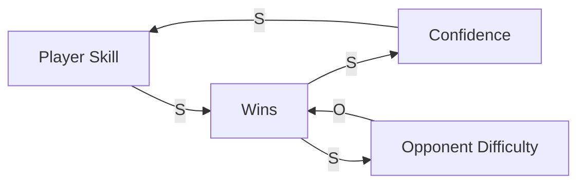
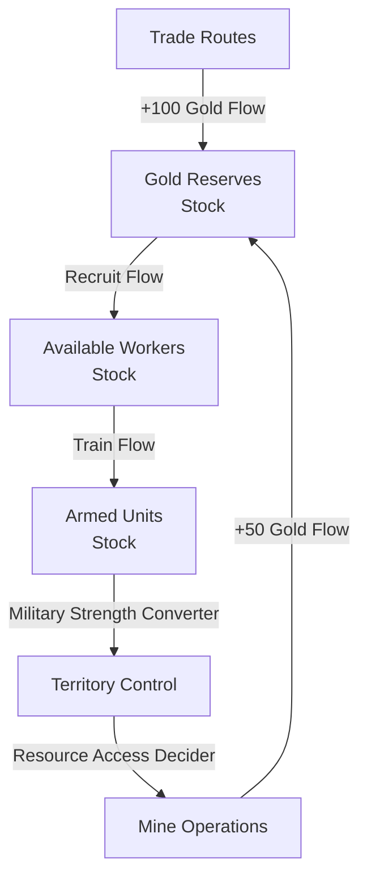

# Advanced Game Design
## Chapter 2 - Defining Systems

<!-- end_slide -->

> It is important to remember, however, that systems (and things, deep down) are dynamic, not  static: you cannot understand a system by freezing it in place; you must experience it operating  in its context to truly understand it... it is difficult to define them in a single bumper-sticker-like  sentence.

<!-- end_slide -->
# Definition of a System

> A set of parts that together form loops of interaction between them to create a persistent "whole." The  whole has its own properties and behaviors belonging to the group but not to any single part within it.

<!-- end_slide -->
# Definition of a System
■ Systems are made out of parts. Parts have internal state and external boundaries. They  interact with other parts via behaviors. Behaviors send information or, more often, resources to other parts to affect the internal state of the other parts.

<!-- end_slide -->
# Definition of a System
■ Systems are made out of parts. Parts have internal state and external boundaries. They  interact with other parts via behaviors. Behaviors send information or, more often, resources to other parts to affect the internal state of the other parts.

■ Parts interact with other parts via behaviors to create loops. Behaviors create local  interactions (A to B), while loops create transitive interactions (A to B to C to A).

<!-- end_slide -->
# Definition of a System
■ Systems are made out of parts. Parts have internal state and external boundaries. They  interact with other parts via behaviors. Behaviors send information or, more often, resources to other parts to affect the internal state of the other parts.

■ Parts interact with other parts via behaviors to create loops. Behaviors create local  interactions (A to B), while loops create transitive interactions (A to B to C to A).

 ■ Systems are organized into hierarchical integrative levels that arise from emergent properties based on their looped structures. At each level, the system displays organized  state and behavior, synonymous with being a part in larger system at the next level up.

<!-- end_slide -->
# Definition of a System
■ Systems are made out of parts. Parts have internal state and external boundaries. They  interact with other parts via behaviors. Behaviors send information or, more often, resources to other parts to affect the internal state of the other parts.

■ Parts interact with other parts via behaviors to create loops. Behaviors create local  interactions (A to B), while loops create transitive interactions (A to B to C to A).

 ■ Systems are organized into hierarchical integrative levels that arise from emergent properties based on their looped structures. At each level, the system displays organized  state and behavior, synonymous with being a part in larger system at the next level up.

 ■ At each level the system displays persistence and adaptability. It does not fall apart quickly,  being self-reinforcing, and is able to tolerate and adapt to different conditions that exist  outside its boundaries.

<!-- end_slide -->
# Definition of a System
■ Systems are made out of parts. Parts have internal state and external boundaries. They  interact with other parts via behaviors. Behaviors send information or, more often, resources to other parts to affect the internal state of the other parts.

■ Parts interact with other parts via behaviors to create loops. Behaviors create local  interactions (A to B), while loops create transitive interactions (A to B to C to A).

 ■ Systems are organized into hierarchical integrative levels that arise from emergent properties based on their looped structures. At each level, the system displays organized  state and behavior, synonymous with being a part in larger system at the next level up.

 ■ At each level the system displays persistence and adaptability. It does not fall apart quickly,  being self-reinforcing, and is able to tolerate and adapt to different conditions that exist  outside its boundaries.

 ■ Systems exhibit organized, decentralized, but coordinated behaviors. A system creates a  unified whole—which is in turn just a part of a larger system.

<!-- end_slide -->
# Parts

Each part is independent of others in  that each has its own identity and acts on its own. Specifically, each part is defined by its state, boundaries, and behaviors,

<!-- end_slide -->
## State
> Each part has its own internal state. This is made up of a combination of attributes, each of  which has a specific value at any point in time. So each bird in a flock has its own speed,  direction, mass, health, and so on. The bird’s speed and mass are attributes, and each have a  value (for these, a number) that is the attribute’s current state. The part’s state overall is the  aggregation of all of its current attribute values.
<!-- end_slide -->

> In games, a part’s state is often determined by the states of parts within it at a finer level of  detail: a forest might not have its own “health” attribute but instead may use the aggregate of  the state of every tree defined within it. However, at some point you have to “hit bottom” and  create simple parts with attribute/value pairs that are simple, nonsystemic types—integers,
<!-- end_slide -->
## Boundaries
> A part’s boundary is an emergent property... defined by  the local neighborhood of interaction of subparts within it.

<!-- end_slide -->

## Behaviors
> Parts affect each other via their behaviors. Each part has something that it does—most often  some resource it creates, changes, or destroys in the system. These behaviors may be simple  or complex, and they typically affect other parts by communicating some resource or value  change to them.
<!-- end_slide -->

# Systems Analysis Methods
Two primary approaches for analyzing game systems:
- **Causal Loop Diagrams** - Focus on feedback relationships
- **Stock and Flow Diagrams** - Focus on accumulation and rates

<!-- end_slide -->

# Causal Loop Diagrams

Best for analyzing **feedback-heavy systems** where variables influence each other in loops

<!-- end_slide -->

## Causal Loop Components: Variables

**Variables** are key game elements that change during play
- Player score
- Resource levels  
- Turn position
- Player health
- Territory controlled

*Variables should be measurable and change over time*

<!-- end_slide -->

## Causal Loop Components: Causal Links

**Causal Links** connect variables with arrows showing relationships:

- **S notation**: When one variable ↑ the linked variable ↑
- **O notation**: When one variable ↑ the linked variable ↓

Examples: 
- More practice (↑) → Better skill (↑) = **S** link
- Higher difficulty (↑) → Player deaths (↑) = **S** link  
- More player deaths (↑) → Player satisfaction (↓) = **O** link

<!-- end_slide -->

## Causal Loop Components: Feedback Loops

**Reinforcing Loop (R)**: Accelerates change in one direction
- "Rich get richer" or "Snowball effect"
- Example: Better equipment → Easier wins → More resources → Better equipment

**Balancing Loop (B)**: Seeks equilibrium or limits growth  
- Self-correcting mechanisms
- Example: High score → Harder difficulty → More deaths → Lower score

<!-- end_slide -->

## Causal Loop Example

*S = Same direction, O = Opposite direction*
*Reinforcing Loop: Skill → Wins → Confidence → Skill*
*Balancing Loop: Wins → Difficulty → Wins*

<!-- end_slide -->

# Systems Examples

## Cookie Clicker

<!-- end_slide -->

## Tetris

<!-- end_slide -->

## Super Mario

<!-- end_slide -->

# Stock and Flow Diagrams

Best for analyzing **resource/accumulation systems** where things build up over time

<!-- end_slide -->

## Stock and Flow Components: Stocks

**Stocks** are things that can be accumulated or stored:
- Points/Score
- Cards in hand
- Territory owned
- Energy/Mana
- Experience points

*Stocks are like bathtubs - they hold "stuff"*

<!-- end_slide -->

## Stock and Flow Components: Flows

**Flows** are rates that change stocks over time:
- Points earned per turn
- Cards drawn per round
- Territory gained per action
- Energy consumed per ability
- Experience gained per victory

*Flows are like faucets and drains - they add or remove from stocks*

<!-- end_slide -->

## Stock and Flow Components: Converters

**Converters** modify flow rates based on conditions:
- Multipliers (2x points bonus)
- Efficiency bonuses (draw extra cards)
- Penalties (half damage when wounded)
- Scaling factors (cost increases with level)

*Converters change how fast the faucets flow*

<!-- end_slide -->

## Stock and Flow Components: Deciders

**Deciders** control when flows activate:
- Game rules and triggers
- Player choices and decisions  
- Random events
- Conditional logic (if/then statements)

*Deciders are like switches that turn flows on/off*

<!-- end_slide -->

## Stock and Flow Example

*Stocks accumulate resources, Flows change stock levels*

<!-- end_slide -->

# Choosing Your Analysis Method

**Use Causal Loop Diagrams when:**
- Multiple variables influence each other
- Feedback effects are central to gameplay
- System behavior emerges from relationships

**Use Stock and Flow Diagrams when:**
- Resources accumulate over time
- Rates of change are important
- Clear inputs/outputs exist

<!-- end_slide -->
